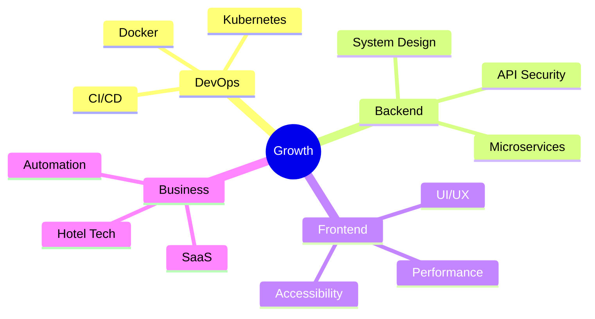

<div align="center">


</div>

---

<div align="center">

### 🚀 Building real-world software for business automation

🏨 Hotel PMS • 🏠 Rental & Guest House SaaS • 💰 TongTin Platform • 📱 Telegram Mini Apps

</div>

---

## 🧑‍💻 About Me

```ts
const chanSokkong = {
  role: "Full Stack Developer",
  focus: ["SaaS", "Hotel PMS", "Rental Management", "Business Automation"],
  frontend: ["Next.js", "React", "Vue 3", "TypeScript", "Tailwind CSS"],
  backend: ["Node.js", "Laravel", "Express.js", "Next.js API Routes"],
  database: ["PostgreSQL", "MySQL", "Prisma"],
  devops: ["Docker", "Linux", "Nginx", "PM2", "Cloudflare"],
  currentlyLearning: ["Kubernetes", "DevOps", "System Design", "Web Security"],
};
```

---

## 🛠️ Tech Stack

<div align="center">

### Frontend


### Backend


### Database


### DevOps & Tools


</div>

---

## 🚧 Currently Building

| Project               | Description                                     | Stack                           |
| --------------------- | ----------------------------------------------- | ------------------------------- |
| 🏨 Hotel PMS          | Property Management System for hotel operations | Vue 3, PrimeVue, TanStack Query |
| 🏠 StayNine           | Rental & Guest House Management SaaS            | Next.js, Prisma, PostgreSQL     |
| 💰 TongTin            | Rotating savings group management platform      | Next.js, PostgreSQL             |
| 📱 Telegram Mini Apps | Business mini applications inside Telegram      | Laravel, React                  |

---

## 📊 GitHub Activity

<div align="center">


</div>

---

## 🐍 Contribution Animation

<div align="center">


</div>

---

## 🌱 Learning Roadmap



---

<div align="center">


</div>
